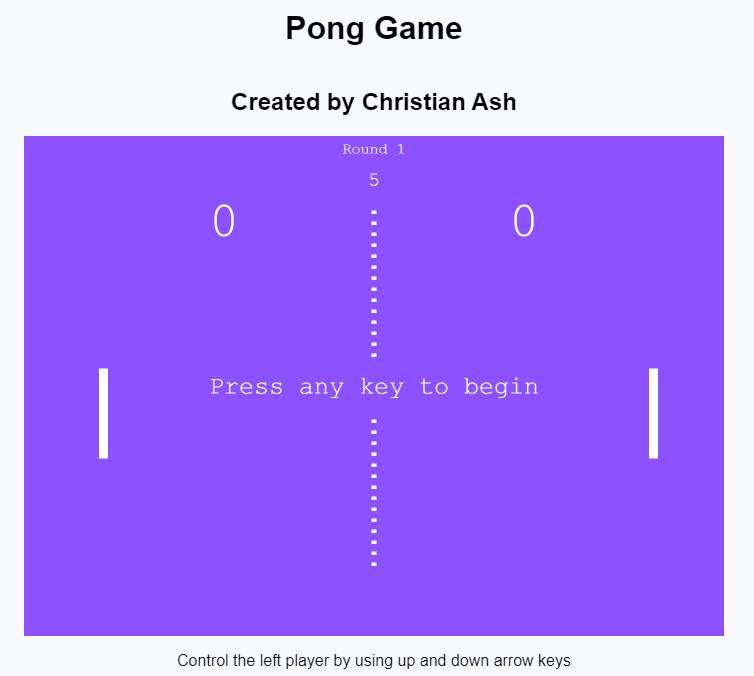

# Pong

## How to Play: 
 - Pong is a simple game, which consists of a paddle (which is controlled by the user) and a ball. 
 - The ball bounces off the paddle and three walls. If the ball hits the paddle, the user gains points; if the ball hits behind the paddle, the game is over.

*Screenshot of my Pong Game*:

*Vidoe of my Pong Game*:

### Reference:

[Pong Game Video](https://www.youtube.com/watch?v=jrqN0uZwhwk "EASY Pong Game in JavaScript Tutorial - QUICK BEGINNER PROJECT")