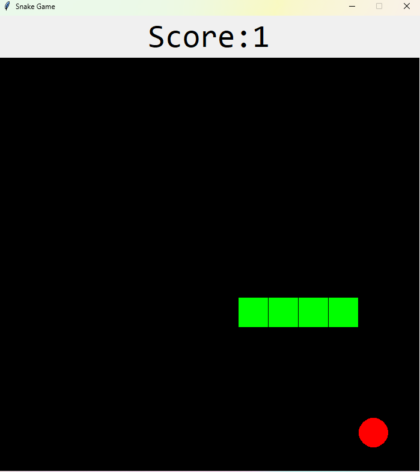
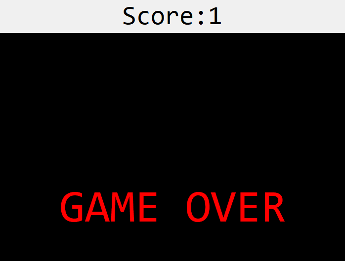

# Sanke Game

## How to Play: 
 - In the game of Snake, the player uses the arrow keys to move a "snake" around the board.
 - As the snake finds food, it eats the food, and thereby grows larger. The game ends when the snake either moves off the screen or moves into itself. The goal is to make the snake as large as possible before that happens

*Screenshot of Snake Game*:

*Screenshot of Snake Game: Game Over Screen*:

### Reference:

